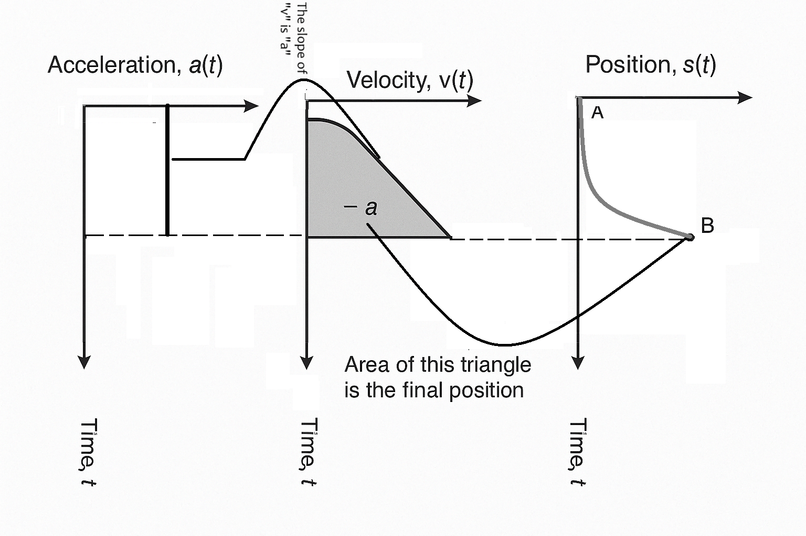
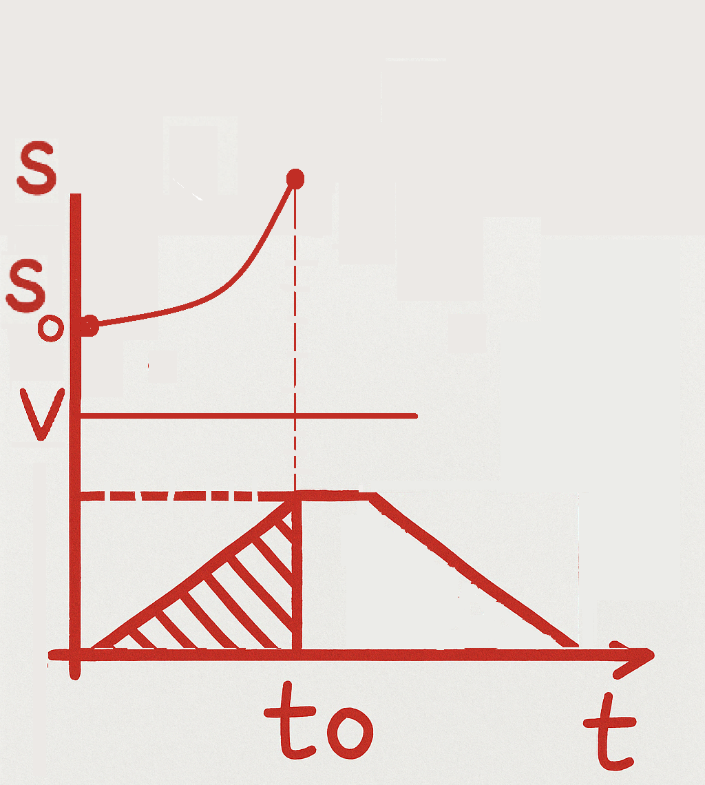
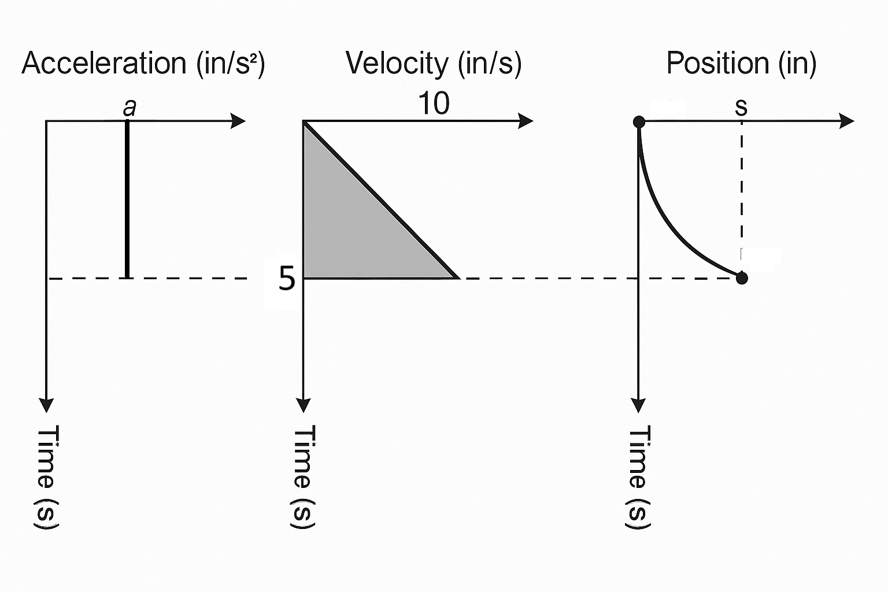
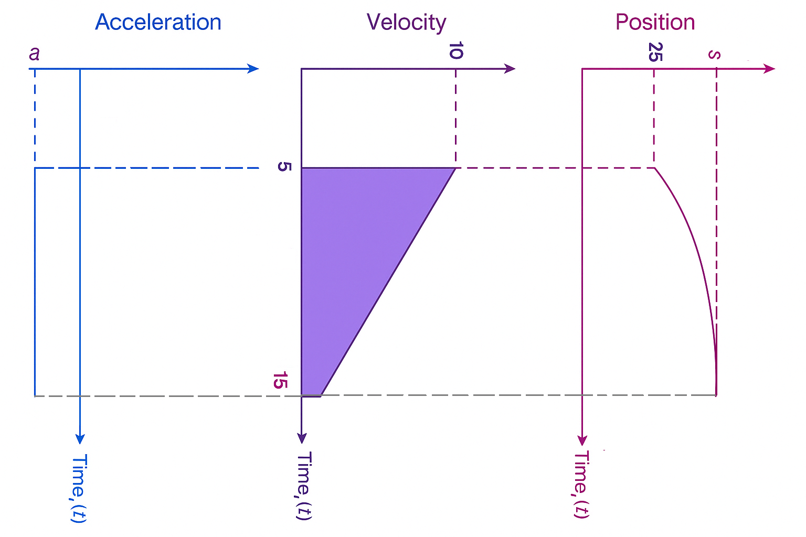
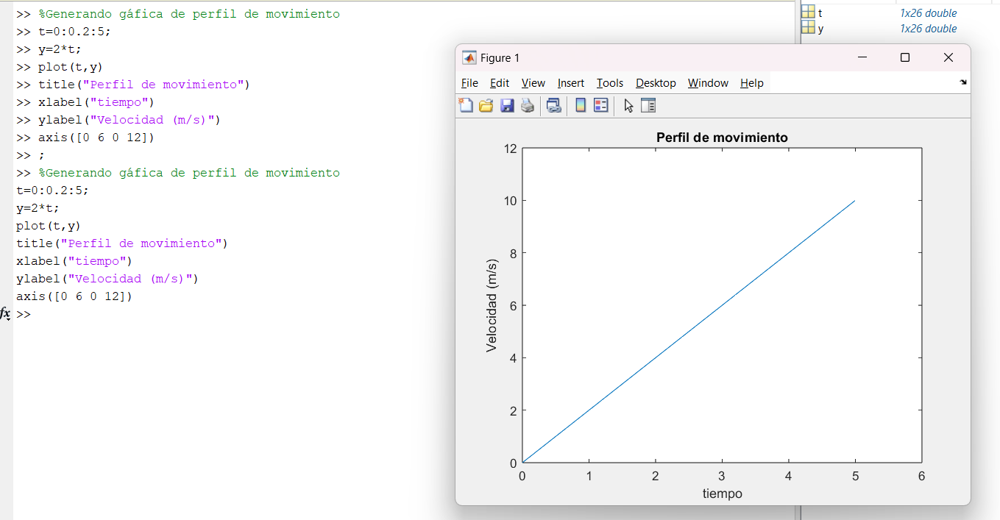

# CLASE 2 II CORTE
# PERFILES DE MOVIMIENTO
Se define como una trayectoria, es la distacia que debe moverse el mecanismo desde un punto A  hasta un punto B. Si se tiene un solo eje, ese perfil de movimiento serìa una lìnea recta, es de aclarar que cuando se tiene mas ejes, se tendran trayectorias mas complejas, ademàs interactuan entre ellos para lograr tareas especìficas. Desde le controlador se debe garantizar que el perfil de movimiento se cumpla. 
En muchas aplicaciones, no basta solo con mover algo de un punto A a un punto B, en las plantas modernas se requiere que esta trayectoria tenga una velocidad y aceleraciòn determinada, con el objetivo de proteger la planta o el mismo producto. 

## Conceptos básicos
**Cinemática:** Tener claro el estudio de la posiciòn, velocidad, aceleraciòn y tiempos para el cálculo de perfil de movimiento y el dimensionamiento de motores. 

-Si se considera un solo eje, la posiciòn será *s(t)*, en funciòn del tiempo, puesto que se requiere saber en cada momento la posiciòn, para asi optimizar las trayectorias y por ejemplo buscar la menor distancia posible, o mejorar la eficiencia del proceso a partir del control. Y en su forma integral $s=\int v(t)\,dt$. 

-La velocidad *v(t)* la razón de cambio con respecto al tiempo. Y en su forma integral $v=\int a(t)\,dt$.  

-La aceleraciòn *a(t)* la razòn de cambio de la velocidad. 

## Curvas
Cuando se diseña un perfil se obtienen las siguientes curvas, estas curvas son diseñadas por el usuario, puesto que se hacen para un caso especifico de acuerdo a las necesidades y movimiento que se quiera en el controlador. Dependiendo de lo que se conozca del proceso se puede comenzar con la curva de posiciòn, sin embargo en la mayoria de procesos se comienza con la curva de velocidad, pues se necesita garatizar cierto desplazamiento por unidad de tiempo, para posteriormente realizar las de posiciòn y aceleraciòn. 

## Reglas geométricas

-La posición es el área bajo el perfil de velocidad.

-La acelaración pendiente de el perfil de velocidad. 

$v=v_0+a(t-t_0)$

$s=s_0+\dfrac{1}{2}(t-t_0)(v_0+a(t-t_0))$

Donde $t_0$ representa el tiempo inicial, $v_0$ la velocidad inicial y $s_0$ la posición en el instante inicial. La aceleración, considerada constante, se denota como $a$.

### Ejemplo

#### 1. 
Encuentre la posición y la aceleración en t=5s  

  

La aceleración sería la pendiente de la velocidad
 $m=\dfrac{10-0}{5-0}=2$
 $a=2$

Posición: 
$s=\dfrac{1}{2}*(10)(5)$
$s= 25\dfrac{in}{s}$

#### 2. 

Un eje está viajando a una velocidad de **10 cm/s**. En **t = 5 s**, empieza a disminuir la velocidad como se ve en el perfil.  ¿Cuál es la posición del eje cuando se detiene?  Asuma que empieza a desacelerar a **25 cm/s²**.

  

La pendiente de la velocidad es la aceleración:  

$$a = \frac{-10 \ \text{cm/s} \cdot \frac{1 \ \text{m}}{100 \ \text{cm}}}{(15 \ \text{s} - 5 \ \text{s})}$$

$$
= \frac{-0.1 \ \text{m/s}}{10 \ \text{s}}
$$

$$
= -0.01 \ \text{m/s}^2
$$

El área del perfil de velocidad triangular es la posición alcanzada en t=15s

$$
S_o = \frac{1}{2} \cdot (15 \ \mathrm{s} - 5 \ \mathrm{s}) \cdot 0.1 \ \frac{\mathrm{m}}{\mathrm{s}} = 0.5 \ \mathrm{m}
$$

#### 3. 

Un eje (axis) lineal comienza su movimiento desde el reposo en la posición 0, con una velocidad de $2\ \text{m/s}$.   Después de moverse durante $5\ \text{s}$, ¿cuál es la posición del eje (axis)?  

  

### Perfiles de movimientos comunes

Los mas usados son perfiles trapeziodal (lineales) y curva en s sigmoidal o gaussiano (no lineales). Estos son los tipos de perfiles que se pueden programar en el controlador. 

**Trapezoidal**
 *Tomado de: [Nombre de la fuente o enlace](https://ejemplo.com)*
Cuando hace el trayecto del punto A al punto B, se tienen tres etapas, en la primera sube la velocidad, para mantener los requerimientos del tiempo, luego cuando llega al punto máximo, se mantiene constante la velocidad, y antes de llegar al punto B se desacelera. 

